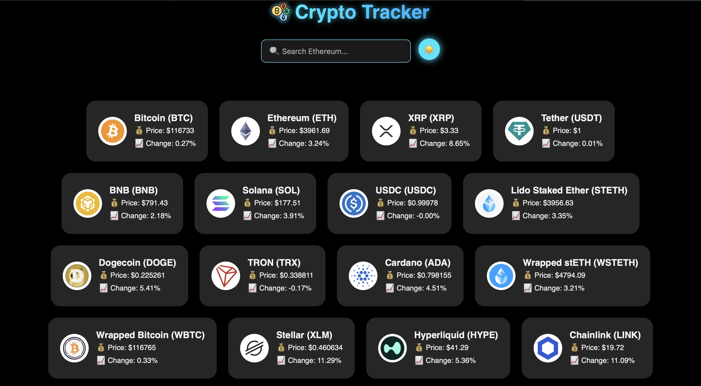
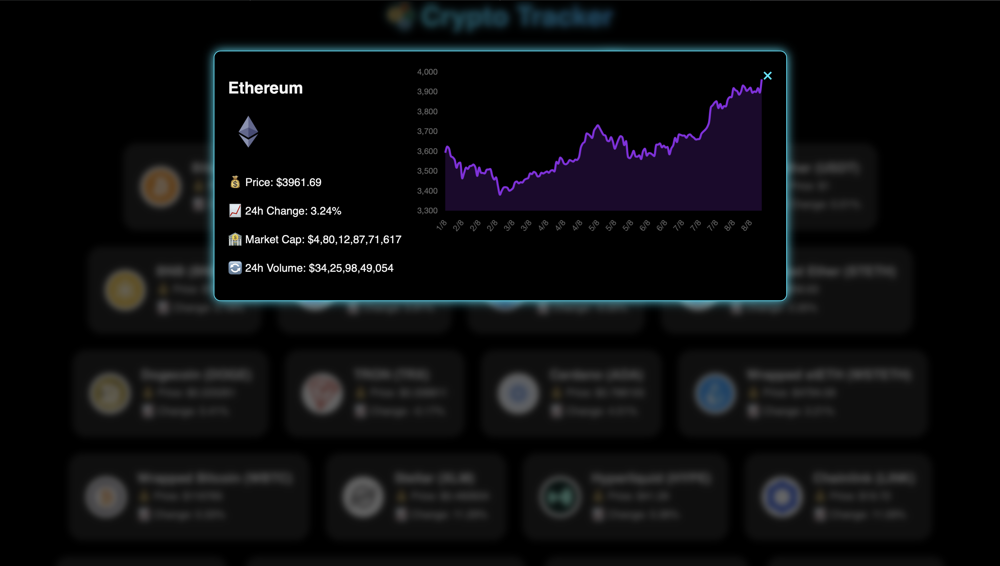

# 💰 Crypto Tracker

A responsive web application that displays real-time cryptocurrency prices, market trends, and percentage changes using the CoinGecko public API.




---

## 🚀 Features

- 🔄 Real-time price updates via CoinGecko API  
- 🌙 Light/Dark theme toggle  
- 🔍 Search bar to filter cryptocurrencies by name or symbol  
- 📱 Fully responsive design for mobile and desktop  
- 📊 Displays graph, current price, 24h change, and coin logo  

---

## 🛠️ Tech Stack

- **HTML**
- **CSS**
- **JavaScript**
- **CoinGecko Public API**

---

## 📷 Preview

> 🔗 **Live Demo:** [https://CodeLife-Godly.github.io/crypto-tracker](https://CodeLife-Godly.github.io/crypto-tracker)

---

## 🧑‍💻 Getting Started

1. **Clone the repository:**
   ```bash
   git clone https://github.com/CodeLife-Godly/crypto-price-tracker.git
   cd crypto-price-tracker
   ```

2. **Open the project in your browser:**
   Just open the `index.html` file.

   - macOS:
     ```bash
     open index.html
     ```
   - Windows:
     ```bash
     start index.html
     ```

3. **(Optional) Use a live server for development:**
   If you're using VS Code:
   - Install the **Live Server** extension
   - Right-click `index.html` → “Open with Live Server”

---


## 🙌 Contributing

Contributions, issues, and feature requests are welcome!  
Feel free to fork the repository and submit a pull request.

---

## 📬 Contact

Created by [@CodeLife-Godly](https://github.com/CodeLife-Godly) — feel free to reach out!
